# PHP MySQLMessageboard

A full‑stack messageboard application with complete CRUD functionality for users, profiles, posts, and comments. Built with PHP, MySQL, Bootstrap 5, and JavaScript, it demonstrates a responsive, production‑style social platform with authentication, profile management, and an admin dashboard. The project includes 15 demo users and over 20 sample posts to showcase how the application behaves with real data.

## Demo
### Screenshots (Desktop)

  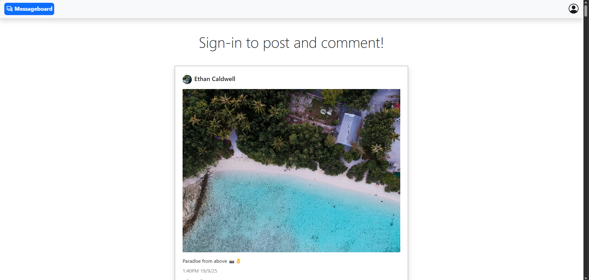
  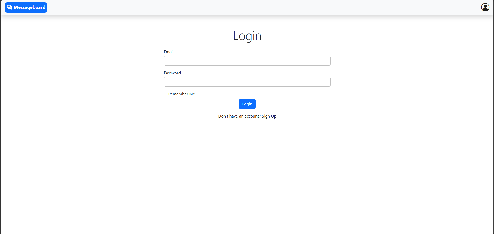
  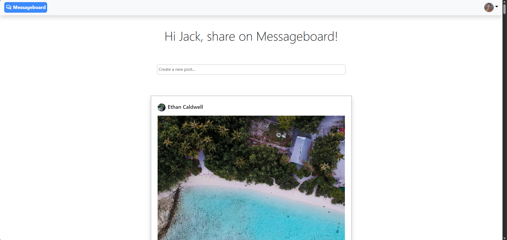
  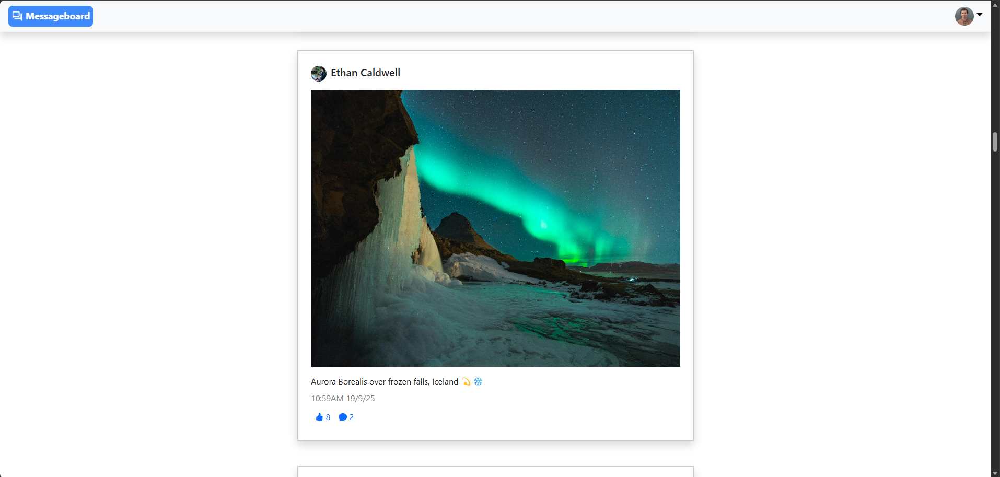
  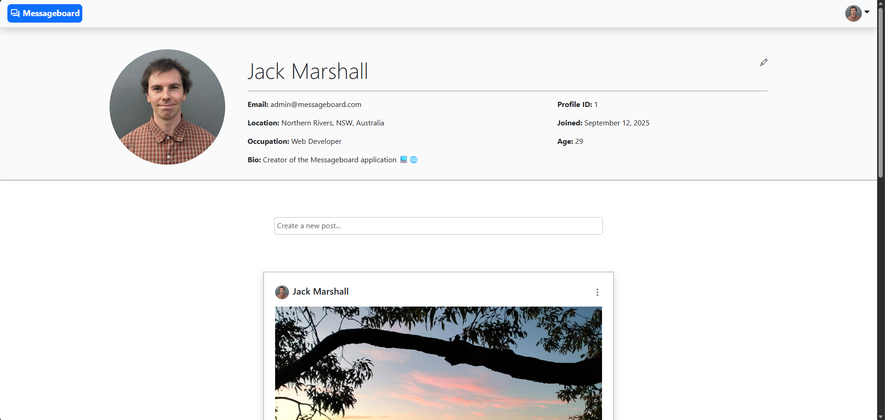
  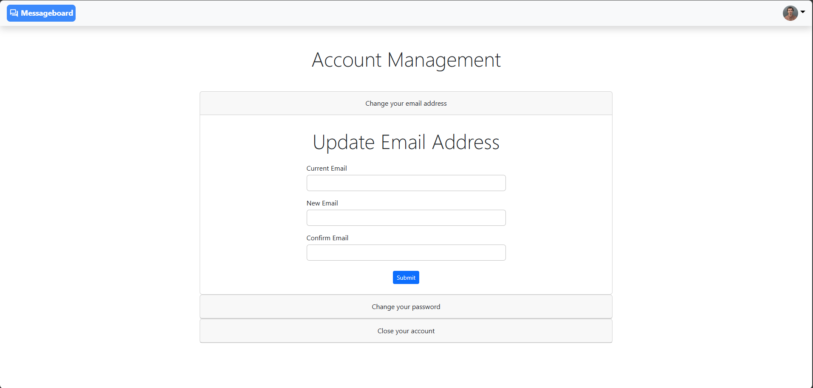
  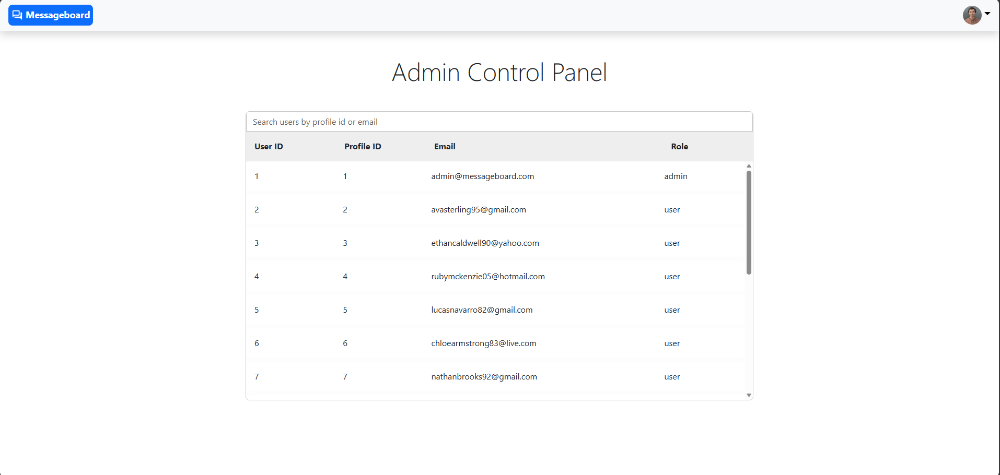
  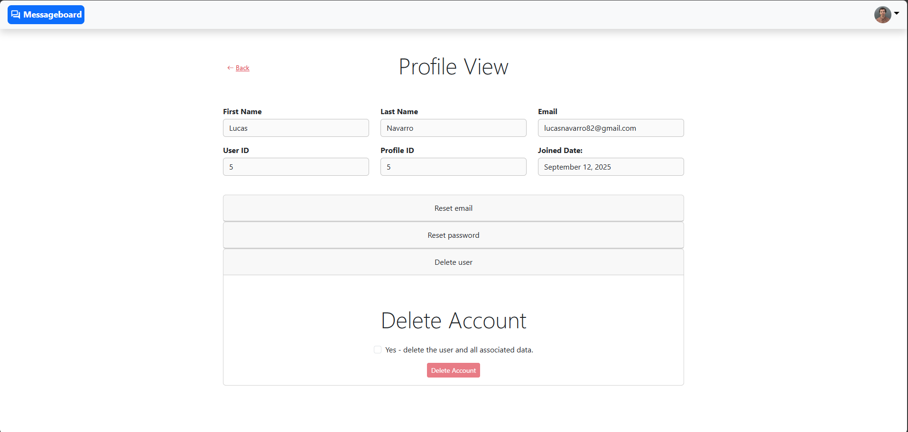

### Video (Desktop)

  

### Screenshots (Mobile)

  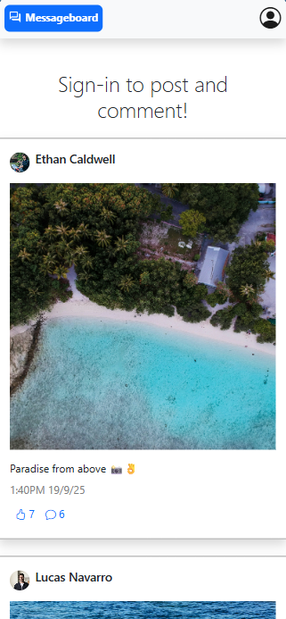
  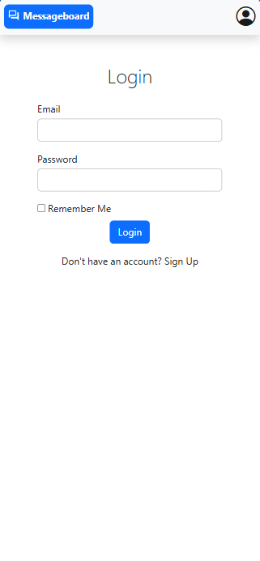
  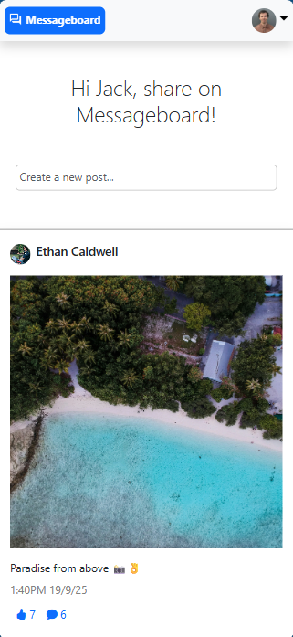
  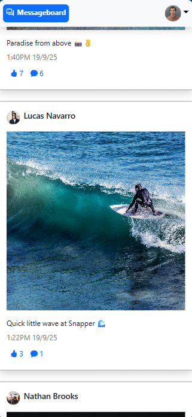
  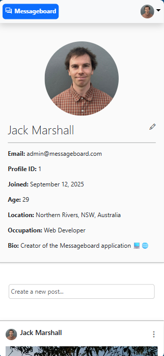
  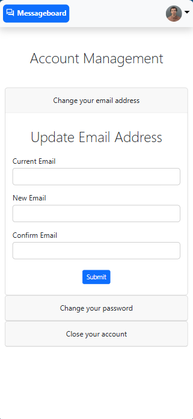
  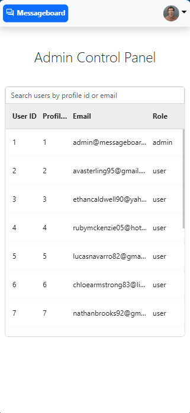
  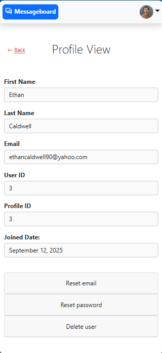

### Video (Mobile)

  

## Features
- **Responsive layout** — adapts seamlessly to desktop and mobile using Bootstrap 5 and custom CSS.
- **Navigation bar** — quick access to all pages, with a brand link returning to the main feed.
- **User authentication** — secure signup, login, and session handling.
- **Main feed** — browse all posts; logged‑in users can create posts, like, comment, and view profiles.
- **User profiles** — view a user's profile details and posts; edit your own profile information.
- **Account management** — update email, change password, or delete your account.
- **Admin dashboard** — role‑based access for managing users, credentials, and account removal.
- **Post creation** — create new posts from the feed or your profile page.
- **Post display system** — reusable component for rendering posts globally or filtering by user.
- **Logout** — clears session data and redirects to login.

## How It Works
- Users authenticate through PHP sessions, which store login state and control access to features.
- Posts, comments, likes, and profiles are stored in a MySQL database with relational tables.
- Reusable PHP components handle shared logic such as fetching and creating posts, rendering posts, and validating forms.
- Role‑based access determines whether a user sees standard features or the admin dashboard.
- AJAX‑style interactions (via JavaScript) update likes and comment functionality without reloading the page.
- Bootstrap 5 ensures responsive layouts across desktop and mobile.

## Tech Stack
- PHP
- MySQL
- Bootstrap 5
- JavaScript
- HTML/CSS

## Installation
1. Clone the repository to your local machine.
2. Start Apache and MySQL in your local environment.
3. Create a new MySQL database named 'messageboard' with collation utf8mb4_general_ci.
4. Import the schema/data from db/messageboard.sql into the database.
5. Duplicate .env-example in the project root and rename it to .env.
6. Add your MySQL credentials to .env (or use the default XAMPP credentials: root with no password).
7. Open the application in your browser at: http://localhost/PHP-MySQL-Messageboard/index.php

## Demo Login
- Use any of the included demo accounts to explore the application.
- Email and password details are available in db/user_details.xlsx.

## Usage
1. Browse the main feed to view posts from all users.
2. Sign up or log in using the navbar avatar or the login page.
3. Create new posts from the main feed or your profile page.
4. Like or comment on posts when logged in.
5. View user profiles by selecting a username or avatar.
6. Edit your profile or update account settings from your profile or account pages.
7. Admin users can access the admin dashboard from the navbar to manage all user accounts.
8. Log out using the navbar menu.

## Future Improvements
 - Posting on other profiles.
 - Video uploads.
 - Multiple media per post.
 - Notifications system.
 - Search functionality.